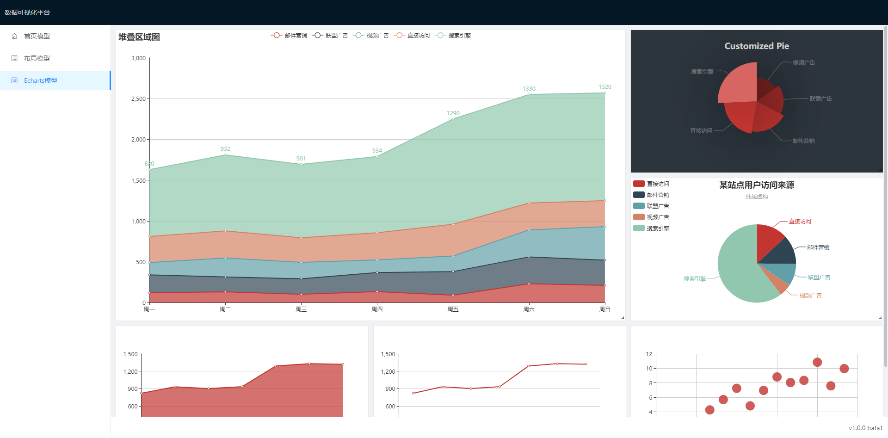

# Echarts

## API - DataVEcharts

| 成员 | 说明 | 类型 | 默认值 |
| --- | --- | --- | --- |
| option | Echarts的数据对象 | object | {} |
| size | Echarts的布局尺寸 | [SizeTypes](#sizetypes) | - |

## API - DataVLayoutEcharts

| 成员 | 说明 | 类型 | 默认值 |
| --- | --- | --- | --- |
| layouts | 可视化图形的布局数据 | [LayoutsProps](#layoutsprops)[] | [] |
| isDesign | 是否为设计模式 | boolean | false |
| onLayoutChange | 可视化图形的元素位置发生变化的回调函数 | Function([PlaceProps](#placeprops)) | - |

## SizeTypes

| 成员 | 说明 | 类型 | 默认值 |
| --- | --- | --- | --- |
| height | 布局高度 | number | - |
| width | 布局高度 | number | - |

## LayoutsProps

| 成员 | 说明 | 类型 | 默认值 |
| --- | --- | --- | --- |
| place | 自适应流布局位置 | [PlaceTypes](#placetypes) | - |
| echarts | Echarts的数据对象 | object | - |

## PlaceTypes

| 成员 | 说明 | 类型 | 默认值 |
| --- | --- | --- | --- |
| w | 元素宽度 | number | - |
| h | 元素高度 | number | - |
| x | 元素X坐标 | number | - |
| y | 元素Y坐标 | number | - |
| i | 元素标识 | number | - |

## 源码

- [DataVEcharts](../src/components/layout-echarts)
- [DataVLayoutEcharts](../src/components/layout-grid-echarts)

## 预览图

