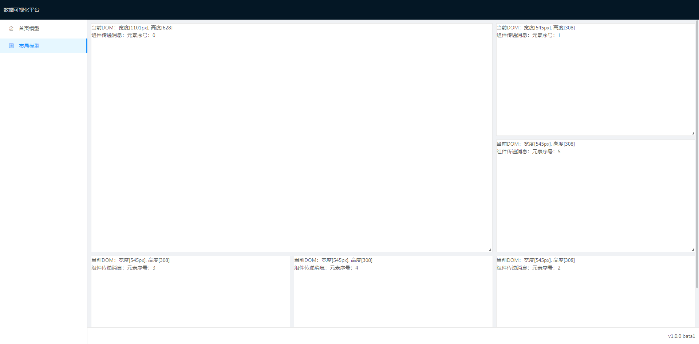

# 自适应流布局

## API - [DataVLayout](../src/components/layout-grid-responsive)

| 成员 | 说明 | 类型 | 默认值 |
| --- | --- | --- | --- |
| layouts | 可视化图形的布局数据 | [LayoutsProps](#layoutsprops)[] | [] |
| isDesign | 是否为设计模式 | boolean | false |
| onLayoutChange | 可视化图形的元素位置发生变化的回调函数 | Function(PlaceProps) | - |

## LayoutsProps

| 成员 | 说明 | 类型 | 默认值 |
| --- | --- | --- | --- |
| place | 自适应流布局位置 | [PlaceTypes](#placetypes) | - |
| dom | 可视化图形的布局内容 | ReactNode | - |

## PlaceTypes

| 成员 | 说明 | 类型 | 默认值 |
| --- | --- | --- | --- |
| w | 元素宽度 | number | - |
| h | 元素高度 | number | - |
| x | 元素X坐标 | number | - |
| y | 元素Y坐标 | number | - |
| i | 元素标识 | number | - |

## 源码

- [DataVLayout](../src/components/layout-grid-responsive)

## 预览图

